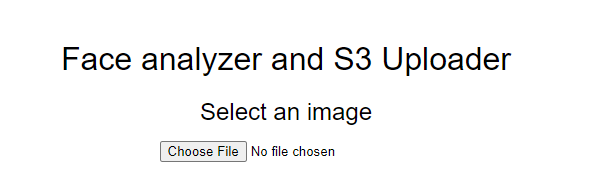
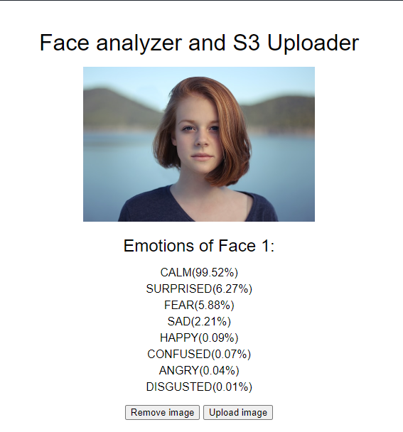
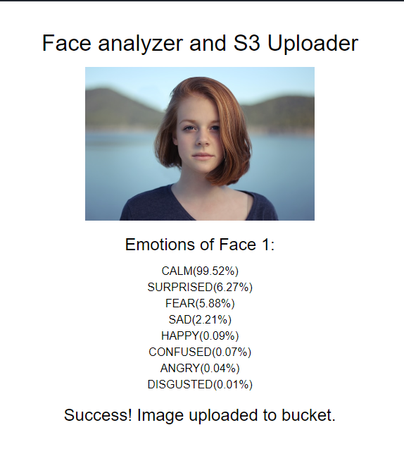
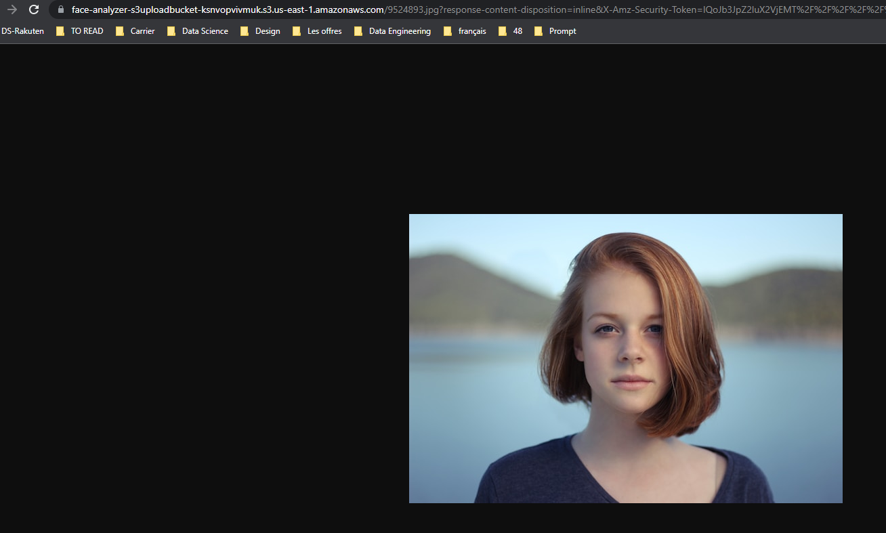

# Face-analyzer

## Presentation 

This repository contains the code of the  serverless image recognition application based on AWS services : Amazon S3, AWS Lambda, and Amazon Rekognition. 

This application allow users to upload image, analyze them, and provide insights about the fealing chart of the personne  the image.

This project was developed with the aim of enhancing understanding of the architecture of AWS services.

## Application
This project contains source code and supporting files for a serverless application that can be deployed with the SAM CLI.

It includes the following files and folders.

- callFaceRecognition - Code for the application's Lambda function.
- getSignedUrl - Code for the application's Lambda function.
- frontend - Code for the application interface

The application uses several AWS resources, including Lambda functions and an API Gateway API. These resources are defined in the `template.yaml` file in this project. 

A project-level configuration and default parameters are stored in the `samconfig.toml`. 

## Requirements
* AWS CLI already configured with Administrator permission
* AWS SAM CLI 
* NodeJS 16.x 

## Deploy the application
To deploy the application for the first time, run the following in your shell:
```
git clone <this project>
cd  face-analyzer
sam deploy --guided
```
This command will package and deploy application to AWS.

Replace API url in file `frontend/index.html` by yours.    

Upload the file `frontend/index.html` to  s3 with grant public-read access. 
Open this file. 

```
const API_ENDPOINT_UPLOAD = 'https://....execute-api.us-east-1.amazonaws.com/uploads'   
const API_ENDPOINT_FACE_ANALYZE = 'https://.....execute-api.us-east-1.amazonaws.com/analyze' 
```
## Application 

First page : 



Load and analyse image :


Upload image to S3 :


Uploaded image :



 

     

